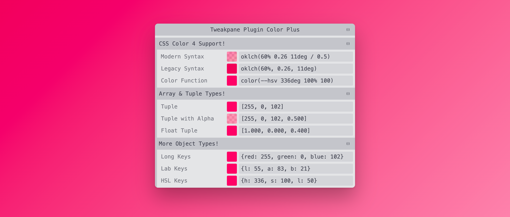

<!--+ Warning: Content inside HTML comment blocks was generated by mdat and may be overwritten. +-->

<!-- title -->

# tweakpane-plugin-color-plus

<!-- /title -->

<picture>
  <source media="(prefers-color-scheme: dark)" srcset="./assets/banner-dark.webp">
  
</picture>

<!-- badges -->

[](https://npmjs.com/package/tweakpane-plugin-color-plus)
[](https://opensource.org/licenses/MIT)

<!-- /badges -->

<!-- short-description -->

**Advanced color handling for Tweakpane.**

<!-- /short-description -->

> [!WARNING]
>
> This Tweakpane plugin is a work in progress and is provided as a zero-versioned pre-release preview. Expect bugs and possible API / UI changes until the first 1.0.0 release.

## Overview

The Color Plus plugin adds support for many additional color formats to the [Tweakpane](https://tweakpane.github.io/docs/) UI library.

The plugin supports all [CSS Color Module Level 4](https://drafts.csswg.org/css-color-4/) formats and color spaces, and adds support for controlling colors stored as tuples / arrays, as well as additional color object formats.

Currently, the plugin (almost) exactly matches the functionality, options, and control presentation of Tweakpane's [built-in color input](https://tweakpane.github.io/docs/input-bindings/#color) — just with support for additional parameter formats and types. This means it should work as a drop-in replacement in existing projects that need to support additional color formats, but it also means that the current UI is not necessarily well-suited to manipulating the wide-gamut colors that can now be represented.

Color notations for perceptually-uniform color spaces like [`oklch`](https://evilmartians.com/chronicles/oklch-in-css-why-quit-rgb-hsl) are supported, **but the current implementation clips all out-of-gamut colors to the `sRGB` color space**. Future versions of the plugin might implement additional UI and options tailored working with wide color targeting the P3 or Rec. 2020 gamuts.

The plugin was developed specifically for the benefit of [Svelte Tweakpane UI](https://kitschpatrol.com/svelte-tweakpane-ui) and [Tweakpane CSS](https://github.com/kitschpatrol/tweakpane-css), but there's no reason it can't be used in vanilla Tweakpane projects as well.

## Getting started

### Dependencies

The plugin requires [Tweakpane 4](https://www.npmjs.com/package/tweakpane).

If you're using the ["lite" build](#the-lite-plugin-build) of the plugin without a bundler, you'll need to provide the [@tweakpane/core](https://www.npmjs.com/package/@tweakpane/core) library as well.

If you're using Svelte 4 or 5 as a front-end library, you might want to take a look at [Svelte Tweakpane UI](https://kitschpatrol.com/svelte-tweakpane-ui), which wraps Tweakpane in a set of Svelte-friendly components, and integrates the Color Plus plugin as part of a preview release.

### Installation

#### NPM

```sh
npm install tweakpane-plugin-color-plus
```

#### CDN

```html
<script src="https://cdn.jsdelivr.net/npm/tweakpane-plugin-color-plus"></script>
```

### Usage

Import and register the plugin. For now, you must explicitly add `view: 'color-plus'` to the `addBinding` options object. (Tweakpane's built-in color input handling will take precedence in the absence of the `view` option.)

#### NPM

<!-- code { file: "./demo/npm/index.js" } -->

```js
import { Pane } from 'tweakpane'
import * as TweakpanePluginColorPlus from 'tweakpane-plugin-color-plus'

const params = {
  color: 'oklch(65% 0.26 357deg)',
}

const pane = new Pane()

pane.registerPlugin(TweakpanePluginColorPlus)

pane.addBinding(params, 'color', { view: 'color-plus' })

pane.on('change', () => {
  document.documentElement.style.backgroundColor = params.color
})
```

<!-- /code -->

#### CDN

<!-- code { file: "./demo/cdn/index.html" } -->

```html
<!doctype html>
<html lang="en">
  <head>
    <meta charset="UTF-8" />
    <title>Tweakpane Plugin Color Plus Demo</title>
    <meta name="viewport" content="width=device-width, initial-scale=1.0" />
    <script type="importmap">
      {
        "imports": {
          "tweakpane": "https://cdn.jsdelivr.net/npm/tweakpane",
          "tweakpane-plugin-color-plus": "https://cdn.jsdelivr.net/npm/tweakpane-plugin-color-plus"
        }
      }
    </script>
    <script type="module">
      import { Pane } from 'tweakpane'
      import * as TweakpanePluginColorPlus from 'tweakpane-plugin-color-plus'

      const params = {
        color: 'oklch(65% 0.26 357deg)',
      }

      const pane = new Pane()
      pane.registerPlugin(TweakpanePluginColorPlus)
      pane.addBinding(params, 'color', { view: 'color-plus' })

      pane.on('change', () => {
        document.documentElement.style.backgroundColor = params.color
      })
    </script>
  </head>
  <body></body>
</html>
```

<!-- /code -->

### Features

### Color spaces

As a trade-off between bundle size and flexibility, Color Plus only supports "predefined" color spaces included in the CSS 4 color specification, with the sole addition of `HSV` for parity with the built-in Tweakpane color input implementation.

Supported spaces / color functions include:

- Adobe RGB (1998)
- HSL
- HSV _(for parity with Tweakpane's built-in color input)_
- HWB
- Lab D65
- Lab _(a.k.a. Lab D50)_
- LCH
- Oklab
- Oklch
- Display P3
- ProPhoto RGB
- Rec. 2020
- sRGB
- sRGB Linear
- XYZ D50
- XYZ D65 _(a.k.a. XYZ)_

### Color formats

The Color Plus plugin supports a wide range of parameter values formats beyond those of the built-in Tweakpane color input. The plugin "remembers" the original format of the input value, and will always transform any valid color input value entered in the text field of the Tweakpane UI widget into that format.

#### String formats

Hexadecimal strings values with or without alpha components are supported:

```ts
const hexStrings = {
  hexString: '#ff0066',
  hexStringAlpha: '#ff00667f',
}
```

`0x`-prefixed hex strings like `'0xff0066'` are also supported, but will be normalized to `#`-prefixed representation.

You can input any CSS [`<named-color>`](https://developer.mozilla.org/en-US/docs/Web/CSS/named-color) string like `rebeccapurple` in the widget's text field, but these may not currently be used as initial parameter values, and will be converted to the widget's initial representation format. (Future versions might add additional support for named colors.)

#### Number formats

Numeric values with or without alpha components are supported:

```ts
const numbers = {
  number: 0xff_00_66,
  numberAlpha: 0xff_00_66_7f,
}
```

Decimal representations like `16711782` are also supported, but will be normalized to `0x`-prefixed representation in the widget's text field.

#### Object formats

The Color Plus plugin should "just work" with a range of color object keys, including any combination of long keys like `red` and short keys like `r` and `g`.

The plugin will infer the desired representation from the keys.

Float values are supported via the `type: 'float'` binding parameter:

```ts
const objects = {
  object: { r: 255, g: 0, b: 102 },
  objectAlpha: { r: 255, g: 0, b: 102, a: 0.5 },
  objectFloat: { r: 1, g: 0, b: 0.4 },
  objectFloatAlpha: { r: 1, g: 0, b: 0.4, a: 0.5 },
  objectLongKeys: { red: 255, green: 0, blue: 102 },
  objectLongKeysAlpha: { red: 255, green: 0, blue: 102, alpha: 0.5 },
  objectMixedKeys: { r: 255, green: 0, b: 102 },
  objectHsl: { h: 336, s: 100, l: 50 },
  objectHsv: { h: 336, s: 100, v: 100 },
  objectHwb: { h: 336, w: 0, b: 0 },
  objectLab: { l: 55, a: 83, b: 21 },
  objectLch: { l: 55, c: 85, h: 14 },
}
```

#### Tuple / array formats

Tuple color representations can be useful for interoperability with libraries like [three.js](https://threejs.org/).

Numeric tuple / array values with or without alpha components are supported. Alpha values must be between 0.0 and 1.0:

Float values are supported via the `type: 'float'` binding parameter:

```ts
const tuples = {
  tuple: [255, 0, 102],
  tupleAlpha: [255, 0, 102, 0.5],
  tupleFloat: [1, 0, 0.4],
  tupleFloatAlpha: [1, 0, 0.4, 0.5],
}
```

### Generic CSS `color()` function

The Color Plus plugin supports all [CSS 4 `color()` function strings](https://drafts.csswg.org/css-color-4/#funcdef-color) for the supported color spaces:

```ts
const functions = {
  colorA98Rgb: 'color(a98-rgb 0.86 0 0.39)',
  colorDisplayP3: 'color(display-p3 0.92 0.2 0.41)',
  colorHsl: 'color(hsl 336 100% 50%)',
  colorHwb: 'color(hwb 336 0% 0%)',
  colorLab: 'color(lab 55 66% 16%)',
  colorLabD65: 'color(lab-d65 54 66% 15%)',
  colorLch: 'color(lch 55 56% 4%)',
  colorOklab: 'color(oklab 0.64 0.25 0.05)',
  colorOklch: 'color(oklch 60% 0.24 13deg)',
  colorPrefixHsv: 'color(--hsv 336deg 100% 100)',
  colorProphotoRgb: 'color(prophoto-rgb 0.72 0.28 0.33)',
  colorRec2020: 'color(rec2020 0.8 0.23 0.35)',
  colorSrgb: 'color(srgb 1 0% 40%)',
  colorSrgbLinear: 'color(srgb-linear 1 0 0.13)',
  colorXyz: 'color(xyz 0.44 0.22 0.15)',
  colorXyzD50: 'color(xyz-d50 0.46 0.23 0.11)',
  colorXyzD65: 'color(xyz-d65 0.44 0.22 0.15)',
}
```

### Space-specific functions

You may use the modern `/`-separated format for alpha components, or the legacy `,`-separated format.

```ts
const functions = {
  // hsl() strings (Tweakpane built-in)
  funcHslLegacy: 'hsl(336, 100%, 50%)',
  funcHsl: 'hsl(336 100% 50%)',
  funcHslAlpha: 'hsl(336 100% 50% / 0.5)',
  funcHslLegacyNoUnits: 'hsl(336, 100, 50)',
  funcHslFancyUnits: 'hsl(336deg 100% 50% / .5)',

  // hsla() strings (Tweakpane built-in)
  funcHslaLegacy: 'hsla(336, 100%, 50%, 0.5)',
  funcHsla: 'hsla(336 100% 50% / 0.5)',
  funcHslaLegacyNoUnits: 'hsla(336, 100, 50, 0.5)',
  funcHslaFancyUnits: 'hsla(336deg 100% 50% / 0.5)',

  // hwb() strings
  funcHwbLegacy: 'hwb(336, 0%, 0%)',
  funcHwb: 'hwb(336 0% 0%)',
  funcHwbAlpha: 'hwb(336 0% 0% / 0.5)',

  // lab() strings
  funcLabLegacy: 'lab(55%, 83, 21)',
  funcLab: 'lab(55% 83 21)',
  funcLabAlpha: 'lab(55% 83 21 / 0.5)',

  // lch() strings
  funcLchLegacy: 'lch(55, 85, 14)',
  funcLch: 'lch(55 85 14)',
  funcLchAlpha: 'lch(55 85 14 / 0.5)',

  // oklab() strings
  funcOklabLegacy: 'oklab(0.64, 0.25, 0.05)',
  funcOklab: 'oklab(0.64 0.25 0.05)',
  funcOklabAlpha: 'oklab(0.64 0.25 0.05 / 0.5)',

  // oklch() strings
  funcOklchLegacy: 'oklch(60%, 0.26, 11deg)',
  funcOklch: 'oklch(60% 0.26 11deg)',
  funcOklchAlpha: 'oklch(60% 0.26 11deg / 0.5)',

  // rgb() strings (Tweakpane built-in)
  funcRgbLegacy: 'rgb(255, 0, 102)',
  funcRgb: 'rgb(255 0 102)',
  funcRgbAlpha: 'rgb(255 0 102 / 0.5)',

  // rgba() strings (Tweakpane built-in)
  funcRgbaLegacy: 'rgba(255, 0, 102, 0.5)',
  funcRgba: 'rgba(255 0 102 / 0.5)',
}
```

### Implementation notes

#### Tweakpane's built-in color handling

This plugin is largely derived from the core Tweakpane library's color input implementation — it (mostly) reuses the views and controllers, and only really makes significant changes to the model, where it replaces Tweakpane's bespoke color handling functionality with an implementation provided by the [Color.js](https://colorjs.io/) library.

#### Color.js v0.6.0-alpha.1 dependency

Note that Color Plus currently bundles a pre-release version of Color.js, v0.6.0-alpha.1.

(The current v0.5.2 release of the [Color.js](https://colorjs.io/) library is missing some core features on which this plugin depends — specifically retention and access to format-related metadata from the string parsing process.)

The plugin uses Color.js' [procedural API](https://colorjs.io/docs/procedural) and [only imports a subset of available color spaces](#color-spaces) in the interest of performance and bundle size optimization.

#### Other JavaScript color libraries

I investigated a number of libraries to back the internal color representation in the Color Plus plugin. [Color.js](https://colorjs.io/) was selected because it offers "round trip" continuity of per-coordinate string formatting style, but there are a number of great libraries out there with robust support for modern color spaces and formats. Here are a few:

- [ChromaJS](https://gka.github.io/chroma.js/) by [Gregor Aisch](https://driven-by-data.net/)

- [Culori](https://culorijs.org/) by [Dan Burzo](http://danburzo.ro/)

- [thi.ng/color](https://github.com/thi-ng/umbrella/tree/develop/packages/color#readme) by [Karsten Schmidt](https://mastodon.thi.ng/@toxi)

#### The "lite" plugin build

The [Rollup](https://rollupjs.org) configuration provided in the [Tweakpane plugin template](https://github.com/tweakpane/plugin-template) does not externalize [`@tweakpane/core`](https://github.com/cocopon/tweakpane/tree/main/packages/core) as a production dependency.

Instead, it gets built into the single-file plugin artifact, which is typically what's published to NPM and imported by plugin consumers. This makes it easy to import as an ES module from a URL, but means that larger projects importing multiple Tweakpane plugins end up with duplicate bundled copies of the `@tweakpane/core` code, adding about \~100 Kb to the final minified build for each plugin after the first.

To avoid this size penalty, Color Plus includes a "lite" version of the build, which is configured to externalize the `@tweakpane/core` dependency. This allows multiple Tweakpane plugins to share a single instance of the `@tweakpane/core`. (I also maintain [forks of a number of popular Tweakpane plugins](https://kitschpatrol.com/svelte-tweakpane-ui/docs/plugins#bundled-plugins) with the `@tweakpane/core` dependency externalization optimization.)

You can import the "lite" version like this:

```ts
import * as TweakpanePluginColorPlus from 'tweakpane-plugin-color-plus/lite'
```

If you're not using a bundler, direct ESM imports from URLs can still work by defining the `@tweakpane/core` dependency manually in an [importmap](https://developer.mozilla.org/en-US/docs/Web/HTML/Element/script/type/importmap).

Or, if you're just using a single plugin and would rather not think about it, a "classic" all-inclusive build is exported by default to match the typical behavior of a Tweakpane plugin:

```ts
import * as TweakpanePluginColorPlus from 'tweakpane-plugin-color-plus'
```

You can see the effect of externalization on the minified library's size below:

<!-- size-table { files: ["./dist/tweakpane-plugin-color-plus.min.js", "./dist/tweakpane-plugin-color-plus.lite.min.js"] } -->

| File                                    | Original | Gzip    | Brotli  |
| --------------------------------------- | -------- | ------- | ------- |
| tweakpane-plugin-color-plus.min.js      | 192.3 kB | 49.9 kB | 41.6 kB |
| tweakpane-plugin-color-plus.lite.min.js | 82 kB    | 27.9 kB | 23.9 kB |

<!-- /size-table -->

## Maintainers

[@kitschpatrol](https://github.com/kitschpatrol)

## Acknowledgments

Thank you to [Hiroki Kokubun](https://cocopon.me) for creating and maintaining the excellent [Tweakpane](https://tweakpane.github.io/docs/) library.

Thanks also to [Lea Verou](http://lea.verou.me/) and [contributors](https://github.com/color-js/color.js/graphs/contributors) for creating the [Color.js](https://colorjs.io/) library.

<!-- footer -->

## Contributing

[Issues](https://github.com/kitschpatrol/tweakpane-plugin-color-plus/issues) and pull requests are welcome.

## License

[MIT](license.txt) © Eric Mika

<!-- /footer -->
