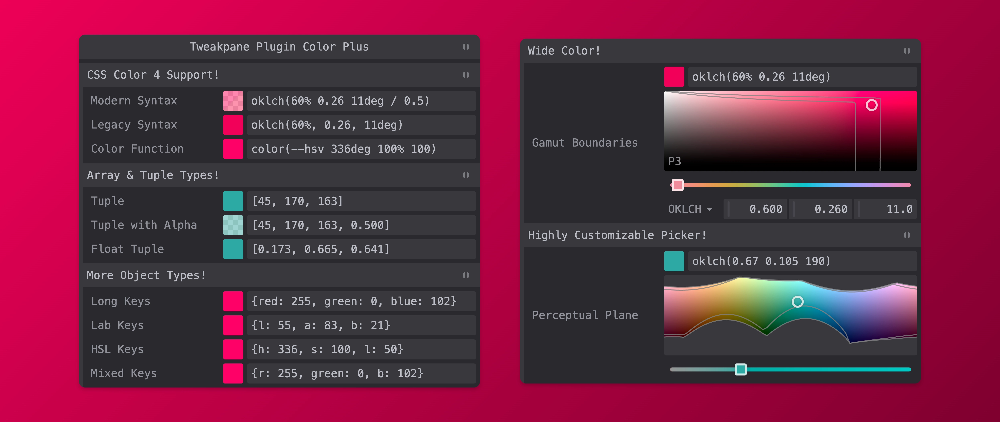

<!-- title -->

# tweakpane-plugin-color-plus

<!-- /title -->



<!-- badges -->

[](https://npmjs.com/package/tweakpane-plugin-color-plus)
[](https://opensource.org/license/mit/)
[](https://github.com/kitschpatrol/tweakpane-plugin-color-plus/actions/workflows/ci.yml)

<!-- /badges -->

<!-- short-description -->

**Advanced color handling for Tweakpane.**

<!-- /short-description -->

> [!WARNING]
>
> This Tweakpane plugin is a work in progress and is provided as a zero-versioned pre-release preview. Expect bugs and possible API / UI changes until the first 1.0.0 release.

## Overview

The Color Plus plugin adds support for handling wide color and many additional color formats to the [Tweakpane](https://tweakpane.github.io/docs/) UI library.

The plugin supports all [CSS Color Module Level 4](https://drafts.csswg.org/css-color-4/) formats and color spaces, and adds support for controlling colors stored as tuples / arrays, as well as additional color object formats. It also subtly revises the color picker UI to handle wide gamut colors.

The plugin is a clean superset of the functionality, options, and control presentation of Tweakpane's [built-in color input](https://tweakpane.github.io/docs/input-bindings/#color), in the hope that it can work as a minimally-invasive drop-in replacement in existing projects that need support for modern color.

The plugin was developed for the benefit of [Svelte Tweakpane UI](https://kitschpatrol.com/svelte-tweakpane-ui) and [Tweakpane CSS](https://github.com/kitschpatrol/tweakpane-css), but there's no reason it can't be used in vanilla Tweakpane projects as well.

## Getting started

### Dependencies

The plugin requires [Tweakpane 4](https://www.npmjs.com/package/tweakpane).

If you're using the ["lite" build](#the-lite-plugin-build) of the plugin without a bundler, you'll need to provide the [@tweakpane/core](https://www.npmjs.com/package/@tweakpane/core) library as well.

If you're using Svelte 4 or 5 as a front-end library, you might want to take a look at [Svelte Tweakpane UI](https://kitschpatrol.com/svelte-tweakpane-ui), which wraps Tweakpane in a set of Svelte-friendly components, and integrates the Color Plus plugin as part of a preview release.

### Installation

#### NPM

```sh
npm install tweakpane-plugin-color-plus
```

#### CDN

```html
<script src="https://cdn.jsdelivr.net/npm/tweakpane-plugin-color-plus"></script>
```

### Usage

Import and register the plugin. For now, you must explicitly add `view: 'color-plus'` to the `addBinding` options object. (Tweakpane's built-in color input handling will take precedence in the absence of the `view` option.)

#### NPM

<!-- code({ file: "./demo/npm/index.js" }) -->

```js
import { Pane } from 'tweakpane'
import * as TweakpanePluginColorPlus from 'tweakpane-plugin-color-plus'

const params = {
  color: 'oklch(65% 0.26 357deg)',
}

const pane = new Pane()

pane.registerPlugin(TweakpanePluginColorPlus)

pane.addBinding(params, 'color', { view: 'color-plus' })

pane.on('change', () => {
  document.documentElement.style.backgroundColor = params.color
})
```

<!-- /code -->

#### CDN

<!-- code({ file: "./demo/cdn/index.html" }) -->

```html
<!doctype html>
<html lang="en">
  <head>
    <meta charset="UTF-8" />
    <title>Tweakpane Plugin Color Plus Demo</title>
    <meta name="viewport" content="width=device-width, initial-scale=1.0" />
    <script type="importmap">
      {
        "imports": {
          "tweakpane": "https://cdn.jsdelivr.net/npm/tweakpane",
          "tweakpane-plugin-color-plus": "https://cdn.jsdelivr.net/npm/tweakpane-plugin-color-plus"
        }
      }
    </script>
    <script type="module">
      import { Pane } from 'tweakpane'
      import * as TweakpanePluginColorPlus from 'tweakpane-plugin-color-plus'

      const params = {
        color: 'oklch(65% 0.26 357deg)',
      }

      const pane = new Pane()
      pane.registerPlugin(TweakpanePluginColorPlus)
      pane.addBinding(params, 'color', { view: 'color-plus' })

      pane.on('change', () => {
        document.documentElement.style.backgroundColor = params.color
      })
    </script>
  </head>
  <body></body>
</html>
```

<!-- /code -->

### Options

In addition to Tweakpane's standard binding options, Color Plus accepts the options below.

_Note that some defaults adapt to the gamut reach of the bound color's model: a color in an sRGB-bound model (hex, `rgb()`, `hsl()`, ...) gets a simple sRGB picker, while a color in a wide or perceptual model (`oklch()`, `lab()`, `display-p3`, ...) gets the full wide-gamut treatment. You're free to override these default assumptions via the `gamuts` array option. The affected options are noted below\._

#### Built-in color options

These options mirror Tweakpane's [built-in color input](https://tweakpane.github.io/docs/input-bindings/#color), and behave the same way here.

##### `color.alpha`

For number values only: treat the number as carrying an alpha component in its lowest byte (e.g. `0xff00667f`). Default `false`.

```ts
pane.addBinding(params, 'color', { view: 'color-plus', color: { alpha: true } })
```

##### `color.type`

For object and tuple / array values only: whether channels are integers from 0–255 (`'int'`, the default) or floats from 0–1 (`'float'`). _(The built-in input only applies this to objects; tuple / array support is a Color Plus extension.)_

```ts
pane.addBinding(params, 'color', { view: 'color-plus', color: { type: 'float' } })
```

##### `expanded`

Start with the picker expanded. Default `false`.

##### `picker`

Where the picker appears: `'popup'` (default) or `'inline'`.

#### Color Plus options

These options are added by the plugin.

##### `color.formatLocked`

By default (`true`), any valid color entered in the widget's text field is converted back to the bound value's original format. Set to `false` to let a typed value switch the binding's format to match what was typed. _(Experimental!)_

##### `constrain`

Keep the color inside the widest configured gamut (see [`gamuts`](#gamuts)): picks on the palette plane snap to the in-gamut frontier, while slider moves, typed text, and externally bound values shed chroma (at constant lightness and hue) to fit. Set to `false` to allow out-of-gamut colors. Default `true`.

##### `gamuts`

The RGB gamuts whose boundaries the OKLCH picker draws, as an array of ids. Both colorjs ids and their CSS aliases are accepted: `'srgb'`, `'p3'` / `'display-p3'`, `'a98rgb'` / `'a98-rgb'`, `'rec2020'`, and `'prophoto'` / `'prophoto-rgb'`.

_Adaptive default:_ `['srgb', 'p3']` when the bound color uses a wide or perceptual model, `['srgb']` when it uses an sRGB-bound model.

```ts
pane.addBinding(params, 'color', { view: 'color-plus', gamuts: ['srgb', 'p3', 'rec2020'] })
```

##### `gamutLabel`

Draw the name of the narrowest configured gamut that holds the current color in the picker plane's bottom-left corner. There are some contrast and legibility issues with this to be resolved in a future version.

_Adaptive default:_ `true` when the bound color uses a wide or perceptual model, `false` when it's sRGB-bound.

##### `gamutLines`

Which configured gamut boundaries are stroked over the picker plane:

| Value               | Behavior                                                                             |
| ------------------- | ------------------------------------------------------------------------------------ |
| `'inner'` (default) | Draws the narrower gamuts' lines.                                                    |
| `'outer'`           | Draws the widest gamut's line (otherwise redundant with the drawn plane's own edge). |
| `'all'`             | Draws both.                                                                          |
| `'none'`            | Hides every line.                                                                    |

##### `paletteChannels`

Which OKLCH channels map to the picker plane's axes and the slider, as `[X][Y]_[slider]`: one of `'CL_H'` (default), `'LC_H'`, `'LH_C'`, `'HL_C'`, `'HC_L'`, or `'CH_L'`. All permutations are currently included, but this option will likely be abstracted away into curated choices in a 1.0 release.

##### `paletteProjection`

How the picker plane projects the gamut volume onto its rectangle:

| Value               | Behavior                                                                                                                                                                                                                      |
| ------------------- | ----------------------------------------------------------------------------------------------------------------------------------------------------------------------------------------------------------------------------- |
| `'okhsv'` (default) | Uses an OKHSV saturation / value projection on lightness × chroma layouts (the vivid cusp lands in the corner), falling back to `'stretch'` on other layouts. This is the most similar to Tweakpane's built-in color palette. |
| `'perceptual'`      | Keeps absolute OKLCH spacing — the gamut sits as an irregular region within the plane. This is the most similar to the [oklch.com](https://oklch.com/) graphs.                                                                |
| `'stretch'`         | Fills the plane with the widest gamut, row by row.                                                                                                                                                                            |

##### `swatchFallback`

The active color swatch is split along its diagonal: the upper-left triangle shows the color as your browser renders it, and the lower-right triangle shows the color's sRGB fallback. `swatchFallback` controls how an out-of-gamut color is forced into sRGB for that fallback triangle. It only affects the swatch preview, never the color value itself.

| Value              | Behavior                                                                                                                                                    |
| ------------------ | ----------------------------------------------------------------------------------------------------------------------------------------------------------- |
| `'clip'` (default) | Clamps each channel to its range — the same thing browsers do when painting an out-of-gamut color, so the fallback matches what you actually see on screen. |
| `'css'`            | Applies the [CSS Color 4 gamut-mapping algorithm](https://www.w3.org/TR/css-color-4/#gamut-mapping) (chroma reduction at constant lightness and hue).       |

```ts
pane.addBinding(params, 'color', { view: 'color-plus', swatchFallback: 'clip' })
```

**Why two methods, and why `'clip'` is the default:** the two algorithms resolve out-of-gamut colors differently, and they can disagree dramatically. The CSS algorithm preserves lightness and hue while reducing chroma, so a vivid color at full lightness like `oklch(100% 0.439 13)` maps to **white** — at lightness 1.0 the OKLCH gamut tapers to a single point, and the only in-gamut color is white. Browsers don't run that algorithm when painting; they clip the channels instead, which keeps the color vivid (a saturated magenta, in this example) at the cost of silently shifting its lightness. Because `'clip'` mirrors the browser, it's the default so the fallback swatch matches on-screen rendering. Choose `'css'` if you'd rather see the colorimetrically faithful gamut mapping that CSS specifies (but that no browser actually performs on screen).

##### `textFields`

Show the color model drop-down and per-channel text inputs below the picker palette. Set to `false` to hide them for a more compact, pointer-only picker. (The alpha slider's text input, if present, is unaffected.) Default `true`.

```ts
pane.addBinding(params, 'color', { view: 'color-plus', textFields: false })
```

### Color spaces

As a trade-off between bundle size and flexibility, Color Plus only supports "predefined" color spaces included in the CSS 4 color specification, with the sole addition of `HSV` for parity with the built-in Tweakpane color input implementation.

Supported spaces / color functions include:

- Adobe RGB (1998)
- HSL
- HSV _(for parity with Tweakpane's built-in color input)_
- HWB
- Lab D65
- Lab _(a.k.a. Lab D50)_
- LCH
- Oklab
- Oklch
- Display P3
- ProPhoto RGB
- Rec. 2020
- sRGB
- sRGB Linear
- XYZ D50
- XYZ D65 _(a.k.a. XYZ)_

### Color formats

The Color Plus plugin supports a wide range of parameter values formats beyond those of the built-in Tweakpane color input. The plugin "remembers" the original format of the input value, and will always transform any valid color input value entered in the text field of the Tweakpane UI widget into that format.

#### String formats

Hexadecimal strings values with or without alpha components are supported:

```ts
const hexStrings = {
  hexString: '#ff0066',
  hexStringAlpha: '#ff00667f',
}
```

`0x`-prefixed hex strings like `'0xff0066'` are also supported, but will be normalized to `#`-prefixed representation.

You can input any CSS [`<named-color>`](https://developer.mozilla.org/en-US/docs/Web/CSS/named-color) string like `rebeccapurple` in the widget's text field, but these may not currently be used as initial parameter values, and will be converted to the widget's initial representation format. (Future versions might add additional support for named colors.)

#### Number formats

Numeric values with or without alpha components are supported:

```ts
const numbers = {
  number: 0xff_00_66,
  numberAlpha: 0xff_00_66_7f,
}
```

Decimal representations like `16711782` are also supported, but will be normalized to `0x`-prefixed representation in the widget's text field.

#### Object formats

The Color Plus plugin should "just work" with a range of color object keys, including any combination of long keys like `red` and short keys like `r` and `g`.

The plugin will infer the desired representation from the keys.

Float values are supported via the `type: 'float'` binding parameter:

```ts
const objects = {
  object: { r: 255, g: 0, b: 102 },
  objectAlpha: { r: 255, g: 0, b: 102, a: 0.5 },
  objectFloat: { r: 1, g: 0, b: 0.4 },
  objectFloatAlpha: { r: 1, g: 0, b: 0.4, a: 0.5 },
  objectLongKeys: { red: 255, green: 0, blue: 102 },
  objectLongKeysAlpha: { red: 255, green: 0, blue: 102, alpha: 0.5 },
  objectMixedKeys: { r: 255, green: 0, b: 102 },
  objectHsl: { h: 336, s: 100, l: 50 },
  objectHsv: { h: 336, s: 100, v: 100 },
  objectHwb: { h: 336, w: 0, b: 0 },
  objectLab: { l: 55, a: 83, b: 21 },
  objectLch: { l: 55, c: 85, h: 14 },
}
```

#### Tuple / array formats

Tuple color representations can be useful for interoperability with libraries like [three.js](https://threejs.org/).

Numeric tuple / array values with or without alpha components are supported. Alpha values must be between 0.0 and 1.0:

Float values are supported via the `type: 'float'` binding parameter:

```ts
const tuples = {
  tuple: [255, 0, 102],
  tupleAlpha: [255, 0, 102, 0.5],
  tupleFloat: [1, 0, 0.4],
  tupleFloatAlpha: [1, 0, 0.4, 0.5],
}
```

### Generic CSS `color()` function

The Color Plus plugin supports all [CSS 4 `color()` function strings](https://drafts.csswg.org/css-color-4/#funcdef-color) for the supported color spaces:

_Browsers will consider some of these formats to be invalid as noted below\._

```ts
const functions = {
  // Browser-compatible CSS color() strings
  colorA98Rgb: 'color(a98-rgb 0.86 0 0.39)',
  colorDisplayP3: 'color(display-p3 0.92 0.2 0.41)',
  colorProphotoRgb: 'color(prophoto-rgb 0.72 0.28 0.33)',
  colorRec2020: 'color(rec2020 0.8 0.23 0.35)',
  colorSrgb: 'color(srgb 1 0% 40%)',
  colorSrgbLinear: 'color(srgb-linear 1 0 0.13)',
  colorXyz: 'color(xyz 0.44 0.22 0.15)',
  colorXyzD50: 'color(xyz-d50 0.46 0.23 0.11)',
  colorXyzD65: 'color(xyz-d65 0.44 0.22 0.15)',

  // Plugin-compatible color() string
  // (Works in plugin, but invalid in CSS:
  // use dedicated color functions instead)
  colorPrefixHsv: 'color(--hsv 336deg 100% 100)',
  colorHsl: 'color(hsl 336 100% 50%)',
  colorHwb: 'color(hwb 336 0% 0%)',
  colorLab: 'color(lab 55 66% 16%)',
  colorLabD65: 'color(lab-d65 54 66% 15%)',
  colorLch: 'color(lch 55 56% 4%)',
  colorOklab: 'color(oklab 0.64 0.25 0.05)',
  colorOklch: 'color(oklch 60% 0.24 13deg)',
}
```

### Space-specific functions

You may use the modern `/`-separated format for alpha components, or the legacy `,`-separated format.

```ts
const functions = {
  // hsl() strings (Tweakpane built-in)
  funcHslLegacy: 'hsl(336, 100%, 50%)',
  funcHsl: 'hsl(336 100% 50%)',
  funcHslAlpha: 'hsl(336 100% 50% / 0.5)',
  funcHslLegacyNoUnits: 'hsl(336, 100, 50)',
  funcHslFancyUnits: 'hsl(336deg 100% 50% / .5)',

  // hsla() strings (Tweakpane built-in)
  funcHslaLegacy: 'hsla(336, 100%, 50%, 0.5)',
  funcHsla: 'hsla(336 100% 50% / 0.5)',
  funcHslaLegacyNoUnits: 'hsla(336, 100, 50, 0.5)',
  funcHslaFancyUnits: 'hsla(336deg 100% 50% / 0.5)',

  // hwb() strings
  funcHwbLegacy: 'hwb(336, 0%, 0%)',
  funcHwb: 'hwb(336 0% 0%)',
  funcHwbAlpha: 'hwb(336 0% 0% / 0.5)',

  // lab() strings
  funcLabLegacy: 'lab(55%, 83, 21)',
  funcLab: 'lab(55% 83 21)',
  funcLabAlpha: 'lab(55% 83 21 / 0.5)',

  // lch() strings
  funcLchLegacy: 'lch(55, 85, 14)',
  funcLch: 'lch(55 85 14)',
  funcLchAlpha: 'lch(55 85 14 / 0.5)',

  // oklab() strings
  funcOklabLegacy: 'oklab(0.64, 0.25, 0.05)',
  funcOklab: 'oklab(0.64 0.25 0.05)',
  funcOklabAlpha: 'oklab(0.64 0.25 0.05 / 0.5)',

  // oklch() strings
  funcOklchLegacy: 'oklch(60%, 0.26, 11deg)',
  funcOklch: 'oklch(60% 0.26 11deg)',
  funcOklchAlpha: 'oklch(60% 0.26 11deg / 0.5)',

  // rgb() strings (Tweakpane built-in)
  funcRgbLegacy: 'rgb(255, 0, 102)',
  funcRgb: 'rgb(255 0 102)',
  funcRgbAlpha: 'rgb(255 0 102 / 0.5)',

  // rgba() strings (Tweakpane built-in)
  funcRgbaLegacy: 'rgba(255, 0, 102, 0.5)',
  funcRgba: 'rgba(255 0 102 / 0.5)',
}
```

### Implementation notes

#### Color.js v0.6.x

The plugin uses Color.js' [procedural API](https://colorjs.io/docs/procedural) and [only imports a subset of available color spaces](#color-spaces) in the interest of performance and bundle size optimization.

This dependency is bundled and tree-shaken, so there are no external third-party dependencies in the plugin (except Tweakpane itself).

#### Other JavaScript color libraries

I investigated a number of libraries to back the internal color representation in the Color Plus plugin. [Color.js](https://colorjs.io/) was selected because it offers "round trip" continuity of per-coordinate string formatting style, but there are a number of great libraries out there with robust support for modern color spaces and formats. Here are a few:

- [ChromaJS](https://gka.github.io/chroma.js/) by [Gregor Aisch](https://driven-by-data.net/)

- [Culori](https://culorijs.org/) by [Dan Burzo](http://danburzo.ro/)

- [thi.ng/color](https://github.com/thi-ng/umbrella/tree/develop/packages/color#readme) by [Karsten Schmidt](https://mastodon.thi.ng/@toxi)

#### The "lite" plugin build

The [Rollup](https://rollupjs.org) configuration provided in the [Tweakpane plugin template](https://github.com/tweakpane/plugin-template) does not externalize [`@tweakpane/core`](https://github.com/cocopon/tweakpane/tree/main/packages/core) as a production dependency.

Instead, it gets built into the single-file plugin artifact, which is typically what's published to NPM and imported by plugin consumers. This makes it easy to import as an ES module from a URL, but means that larger projects importing multiple Tweakpane plugins end up with duplicate bundled copies of the `@tweakpane/core` code, adding about \~100 Kb to the final minified build for each plugin after the first.

To avoid this size penalty, Color Plus includes a "lite" version of the build, which is configured to externalize the `@tweakpane/core` dependency. This allows multiple Tweakpane plugins to share a single instance of the `@tweakpane/core`. (I also maintain [forks of a number of popular Tweakpane plugins](https://kitschpatrol.com/svelte-tweakpane-ui/docs/plugins#bundled-plugins) with the `@tweakpane/core` dependency externalization optimization.)

You can import the "lite" version like this:

```ts
import * as TweakpanePluginColorPlus from 'tweakpane-plugin-color-plus/lite'
```

If you're not using a bundler, direct ESM imports from URLs can still work by defining the `@tweakpane/core` dependency manually in an [importmap](https://developer.mozilla.org/en-US/docs/Web/HTML/Element/script/type/importmap).

Or, if you're just using a single plugin and would rather not think about it, a "classic" all-inclusive build is exported by default to match the typical behavior of a Tweakpane plugin:

```ts
import * as TweakpanePluginColorPlus from 'tweakpane-plugin-color-plus'
```

You can see the effect of externalization on the minified library's size below:

<!-- size-table({ files: ["./dist/tweakpane-plugin-color-plus.min.js", "./dist/tweakpane-plugin-color-plus.lite.min.js"] }) -->

| File                                    | Original | Gzip    | Brotli  |
| --------------------------------------- | -------- | ------- | ------- |
| tweakpane-plugin-color-plus.min.js      | 210.5 kB | 55.9 kB | 47.3 kB |
| tweakpane-plugin-color-plus.lite.min.js | 102.2 kB | 33.7 kB | 29.6 kB |

<!-- /size-table -->

## Maintainers

[kitschpatrol](https://github.com/kitschpatrol)

## Acknowledgments

Thank you to [Hiroki Kokubun](https://cocopon.me) for creating and maintaining the excellent [Tweakpane](https://tweakpane.github.io/docs/) library.

Thanks also to [Lea Verou](http://lea.verou.me/) and [contributors](https://github.com/color-js/color.js/graphs/contributors) for creating the [Color.js](https://colorjs.io/) library.

Ryan Kiley's recent [tweakpane-plugin-wide-gamut](https://github.com/ryankiley/tweakpane-plugin-wide-gamut) inspired me to finally get around to updating the view layer of this plugin to handle wide color. Ultimately, the [OKLCH Color Picker & Converter](https://oklch.com/) informed the revised view implementation, in combination with Björn Ottosson's [color picker comparison](https://bottosson.github.io/misc/colorpicker/) and accompanying [blog post](https://bottosson.github.io/posts/colorpicker/).

<!-- footer -->

## Contributing

[Issues](https://github.com/kitschpatrol/tweakpane-plugin-color-plus/issues) are welcome and appreciated.

Please open an issue to discuss changes before submitting a pull request. Unsolicited PRs (especially AI-generated ones) are unlikely to be merged.

This repository uses [@kitschpatrol/shared-config](https://github.com/kitschpatrol/shared-config) (via its `ksc` CLI) for linting and formatting, plus [MDAT](https://github.com/kitschpatrol/mdat) for readme placeholder expansion.

## License

[MIT](license.txt) © [Eric Mika](https://ericmika.com)

<!-- /footer -->
